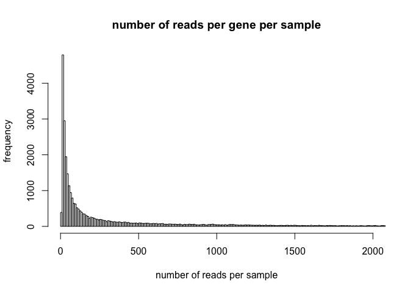

DE\_analysis\_eels
================
Ludovic Dutoit
3/11/2020

First, I go through the dataset, here it is:

```{r}
library(tidyr)
library(DESeq2)
library(pheatmap)
library(stringr)
library(ggplot2)
library(dplyr)
library(matrixStats)
library(pheatmap)
library(edgeR)
library("RColorBrewer")

counts=read.csv("results_files/RSEM_gene_counts.txt", sep="", head=T)
head(counts)
```

```{r}
colnames(counts)
```

```{r}
######### Do the filtering
samples=cbind(colnames(counts),rep(c("silver","yellow"),each=6))
rownames(samples)<-samples[,1]
samples=as.data.frame(samples[,-1])
colnames(samples)<-"treatment"
treatment <- factor(rep(c("silver","yellow"),each=6))
```

### Basic filtering

```{r}
des <- model.matrix(~treatment)
dge <- DGEList(counts=counts) 
keep <- filterByExpr(counts, des) # inside function of limma aware of the design to remove rad counts
dge <- dge[keep,keep.lib.sizes=FALSE]

dge<- calcNormFactors(dge)
print("After filtering, kept a matrix of X genes by Y samples:")
```

```{r}
dim(dge) 
```

### Some visualisation after basic filtering

### Basic stats post filtering

How many reads per gene? This is the distribution in 5% quantiles of number of reads per sample per gene

```{r}
quantile(apply(dge$counts,1,sum)/12,seq(0,1,0.05))
```

Up to 1e6 (maybe rRNA, to check). It means the most expressed genes has 1mio/reads per sample

median is about ten.

Let's visualise it for the bottom 85% (up to 2000)

```{r}
hist(apply(dge$counts,1,sum)/12,xlim=c(0,2000),breaks=100000,main="number of reads per gene per sample",xlab= "number of reads per sample",ylab= "frequency") # 32447 genes passing filtering
```



What are the most expressed genes above 1000000 per sample:

```{r}
which(apply(dge$counts,1,sum)/12>1e6)
```

TRINITY\_DN2028\_c0\_g1 sequence matches Anguilla japonica eZPCa mRNA for egg envelope protein, complete cds:

    >TRINITY_DN2028_c0_g1_i11 RANDOMLY PICKED ISOFORM
    TACAGTAACCTCATGATCCATGCAGTCTGGCTACTGCATTGAAAGCTGCTTGGGGGGGGGGGGGAAATCCAAAACTTGATATAATGGAAGGTACAGAAATGTGGACTCAGAACACAATGATCTGGACAGCACGTTTTGAGGCACTTCAAGTTTTATTCAAAAATCCCCACCCAGTTACAGGACAGGTTTGTAGCGTCTCCACATCAGCACCATCCCCAGCGCAATGATGCAGACCAGTCCCACTGCAGCCATCACTCCAGCCATAAATACCACCTTAGAGGCACCTTCTGCTTGGTGATCTGCATTCAGAGGGCTGATGGACTCAGGTACATCTTTGACAGCCTCCTGGACAACAATTGGGCCTAGGACTGCGCCACCCTCATACTGTATGCCTGTATTCACACTCCTTATCTTCCTCCCACCACAGCTGGTGTCACAGCAGCTACATGCCTGGTCATTCCCAGATGCCTCAATCCACCGTTCCTTCCCAAGAGGAAATGAGCAAGCCTTCCCTTCTGAATCTGGCAAAGCTGCAGTAGCCTTCAGATAGCAGAAAATGTAGACAGCACTCCTGGTCTCCTGGGCAAACCTGAAGGCATCCAGCTGAAGTTGCAGCTTGTCGTCCTGTACCCTTGACAGGAACTGGGAGCGGGAGTTGGTCAGCTTGGAATCCATTAGACACCCCTTGTTCTCAATGAAAGCATATCTGGGGACAGCGTTCATGTCAGGGTCCAAAGTAGCTATACAGGTATCCACAAACACGCGGAGGGGCACGTGGTTGGCCTGGACCACTGAAGCCTCAATGTTGATGAGGTCACCCAGGAAGAACACCGTGGATGTCCTCTCCGTCTGCCAGTTATCAGCCATGAGCCTTAATGAAAATACAAGGAGGTCCTCAGCAGAAAGGGTGGAGTGGTAGGGGATCCAGGTTGGCTTCAGGGCATTACTGCTCACGTTATGCAGCCTCATGTAATGACACTGGATGCCCACCACTGCACTTGATGTCCTAATGATGGGAGTGGCACCAAGTGCTTTAGGTTGGTAGTTCAGGGTGAAGGTGTACACTAGGGAGTCAGCAGTCATTGCAAGCACACTGCCACAGCTGTGCAGCTCAGTCTCAAATAGAAGCACTTGGGTAGACCCATCCAGGTCAACAGGTCCGCAGCCTCCTAGGGTGATGTCAGTGGGCTGGATAAGGTGGCCGATGCCAAGCAGGTCCATATCTACTTCCAACTGAACAGAGCTTTCCCCACAGTGAGCCTTCACAGCATCTGGCTTAGGTGTAGGAGGTTCCACTGGAATTGTTGACC

TRINITY\_DN4587 matches PREDICTED: Anguilla anguilla zona pellucida sperm-binding protein 4-like (LOC118223083), mRNA

    >TRINITY_DN4587_c0_g1_i12 len=1019 path=[4:0-44 6:45-214 7:215-228 8:229-252 9:253-342 11:343-487 12:488-566 14:567-597 15:598-681 17:682-711 19:712-968 20:969-1018]
    ACTTCACTGTGAAGCCTCTGGTCGGTGGCTGTAAGCTCCGTATTGGTCAGGACTACAGGCTTACTGGAAACCACAGCCTTTTCCTCAGGGGACCGCTTGCCTACAGGAGCAATTGACCTTCTTTGCTTTCCACTGCTGCACCGCTGTTCACAGCGATCGGTAGCAGAGGGGTGGCAAACTGCCGTGCTACAGTGGATGAACACCGTTTCCTTCAGTGGAACGAAGGATTCAGGATCCACAAAGGTAAACATCTGCACAATAAACCGCTTGTAGTGACTGGGGAAGAGAAGTCCAGAAGAGGCATCTACAGGAACCAAGGATGTCTGGTAGCGGTCATCACGGTAGGGAGACCCATCAACCAAAAGGCTCCACTGGGGTAGGCTGAGGGGGCTGGAGGTTGATGTAGCCCAGCAGTGTTCCAGAAGCAGGACAAGGTTTGGGTCAGTCCTCTCCAAGATCCGCACTTCCACATACACAGGTTCCCGTAGCACCTTGGTCACGGGGTAGTCCGCATCTCCGTAGTAGTCGCTGTACACAGCATCAGCACATCCACTTGCTCCTTTGGAGTCACATTGACCACTAGCCAGTCTGAGCTCAATGCGAAGGGGCCCTGGAGCAGCTACTGGAAGGGGAGGCGGCACTGTATTCACCTCAGCTACTAAAGAAACCACAGCACTGCCAGAATACCTGCACTGGAAGGACAGCTCATAAATACTGTCCCTTGTGATGGAACCTAAAGGGCCAACGCCCACTTCATATGTGGAGGACATCTTGTTCTCATAGATCACGTAATCCCCTTCCACCCTCACTGTGGTTCCACAGTCACTGACTGGAAATTGGAAGACCGCAAAAGCAGGAGAGGCACTAACAGGACCACAGTAACCGCCACTGGGGCCCTCCAGCAAGTTCACAGAAGGAAGGTCAAGCAGAGGCAAGGTGGCGGCTCTGGACACTACAACCATGAACTGGCCATCCCGGAGACAGTGGACAGTAACTTCATTTGCATAATAGCACTGTTG

### DE analysis

```{r}
logCPM <- cpm(dge, log=TRUE)
design <- model.matrix(~samples$treatment)

v <- voom(dge, design, plot=TRUE, normalize="quantile")
```


```{r}
pdf("MDS.pdf")
plotMDS(v, pch=19, col=rep(c("gray","gold"),each=6),cex=6,frame=F,main="",xlim=c(-2,4),cex.axis=3,xaxt="n",yaxt="n")
dev.off()
```

```{r}
fit <- lmFit(v, design)
fit <- eBayes(fit, trend=TRUE)
results<-topTable(fit, coef=ncol(design),n=Inf)

sum(results$adj.P.Val<0.05)
```

```{r}
##Table of DE genes

#DE_counts are the counts for the DE 
DE_results<-results[results$adj.P.Val<0.05,] # DE_results are only the significant genes(p-value, log Fold-change,,,)
 
DE_counts<-dge[which(rownames(dge)%in%rownames(results)),]$counts #counts for significant genes


#positive means more in yellow
#negative means more in gray


##Overexpressed and underexpressed in general?
length(which(DE_results$logFC<(-1))) # how many genes under expressed in yellow  or more
```

```{r}
length(which(DE_results$logFC>1)) # how many genes over expressed in yellow
```

```{r}
##Overexpressed and underexpressed  by a actor 2 or more
length(which(DE_results$logFC<(-1))) # how many genes under expressed in yellow by a 
```

```{r}
length(which(DE_results$logFC>1)) # how many genes over expressed in yellow
```

```{r}
###Volcano plot (relationship between Log Fold Change and -value)
plot(results$logFC,-log(results$adj.P.Val),pch=10,cex=0.1) 
points(DE_results$logFC,-log(DE_results$adj.P.Val),pch=10,cex=0.1,col="red")
```


```{r}
results <- results %>%  mutate(
    Expression = case_when(logFC >= 0 & adj.P.Val <= 0.05 ~ "Up-regulated",
                           logFC <= 0 & adj.P.Val <= 0.05 ~ "Down-regulated",
                           TRUE ~ "Unchanged"))
  p2 <- ggplot(results, aes(logFC,-log10(adj.P.Val))) +
  geom_point(aes(color = Expression), size = 2/5) +
  xlab(expression("log"[2]*"FC")) + 
  ylab(expression("-log"[10]*"FDR")) +
  scale_color_manual(values = c(  "firebrick3","gray50","dodgerblue3")) +
  guides(colour = guide_legend(override.aes = list(size=10),legend.key.size=10,title=""))  +theme_minimal()+theme(legend.text=element_text(size=20))
  
p2
```


```{r}
ggsave( "ggvolcano.png", plot = p2)
```

```{r}
results <- results %>%  mutate(
    Expression = case_when(logFC >= 0 & adj.P.Val <= 0.05 ~ "Up-regulated",
                           logFC <= 0 & adj.P.Val <= 0.05 ~ "Down-regulated",
                           TRUE ~ "Unchanged"))
  p2 <- ggplot(results, aes(logFC,-log10(adj.P.Val))) +
  geom_point(aes(color = Expression),show.legend=F) +
  xlab(expression("log"[2]*"FC")) + 
  ylab(expression("-log"[10]*"FDR")) +
  scale_color_manual(values = c(  "firebrick3","gray50","dodgerblue3"))   +theme_minimal()
  
p2
```


```{r}
ggsave( "ggvolcanonolegend.png", plot = p2)
```

```{r}
plot(results$AveExpr,results$logFC,pch=10,cex=0.1)
points(DE_results$AveExpr,DE_results$logFC,pch=10,cex=0.1,col="red")
```


Let's output those results as text tables that everyone can play with ( in excel or other). I saved it as [DE\_results.txt](DE_results.txt)

```{r}
final_results_DE<-merge(DE_results,DE_counts,by=0)
colnames(final_results_DE)[1]<-"GeneID"
write.table(final_results_DE,"DE_results.txt",row.names=T,col.names=T,sep="\t")
```

GO writing
==========

```{r}
write(rownames(DE_results),"allDE.txt",sep="n")

write.table(rownames(DE_results)[which(DE_results$logFC>0)],"upregulated.txt",row.names=F,col.names=F,quote=F)
write.table(rownames(DE_results)[which(DE_results$logFC<0)],"downregulated.txt",row.names=F,col.names=F,quote=F)

write(rownames(dge$counts),"backgroundGO.txt",sep="\n")

write(rownames(dge$counts)[-which(rownames(dge$counts)%in%rownames(DE_results))],"backgroundGOnooverlap.txt",sep="n")
```

Split into logfoldchangeabove0 and logfoldchangebelow0

And finally we upload the results for ALL the genes:

```{r}
final_results<-merge(results,dge$counts,by=0)
colnames(final_results)[1]<-"GeneID"
write.table(final_results,"ALLgenes_results.txt",row.names=T,col.names=T,sep="\t")
```

### Saving data for plotting\_genes.R

```{r}
###Careful, dirty fix 
counts<-cpm(dge$counts)
save(counts,results,file="countsand_logFCforplottingGene.RData")
rm(counts) #to make sure I don't use it thinking it is counts
```

Additional figures
------------------

Volcano plot with FC threshold at 2:

```{r}
results <- results %>%  mutate(
    Expression = case_when(logFC >= log2(2) & adj.P.Val <= 0.05 ~ "Up-regulated",
                           logFC <= -log2(2) & adj.P.Val <= 0.05 ~ "Down-regulated",
                           TRUE ~ "Unchanged"))
  p2 <- ggplot(results, aes(logFC,-log10(adj.P.Val))) +
  geom_point(aes(color = Expression),show.legend=F) +
  xlab(expression("log"[2]*"FC")) + 
  ylab(expression("-log"[10]*"FDR")) +
  scale_color_manual(values = c(  "firebrick3","gray50","dodgerblue3"))   +theme_minimal() #+geom_vline(xintercept = c(-2,2),  color = "black", size=0.5)
  
  p2
```


```{r}
  ggsave("ggvolcanoFC2nolegend.pdf",plot = p2)
```

Volcano plot with log2FC threshold at 1.5:

```{r}
results <- results %>%  mutate(
    Expression = case_when(logFC >= log2(1.5) & adj.P.Val <= 0.05 ~ "Up-regulated",
                           logFC <= -log2(1.5) & adj.P.Val <= 0.05 ~ "Down-regulated",
                           TRUE ~ "Unchanged"))
  p2 <- ggplot(results, aes(logFC,-log10(adj.P.Val))) +
  geom_point(aes(color = Expression),show.legend=F) +
  xlab(expression("log"[2]*"FC")) + 
  ylab(expression("-log"[10]*"FDR")) +
  scale_color_manual(values = c(  "firebrick3","gray50","dodgerblue3"))   +theme_minimal() #+geom_vline(xintercept = c(-1.5,1.5),  color = "black", size=0.5)
  
  p2
```


```{r}
  ggsave("ggvolcanonFC15nolegend.pdf",plot = p2)
```

Sample clustering:

```{r}
 dds=DESeqDataSetFromMatrix(countData = round(dge$counts),colData = samples,design = ~rep(c("silver","yellow"),each=6))
```

```{r}
    dds <- DESeq(dds)
```

```{r}
vsd<-vst(dds,blind=T)
sampleDists <- dist(t(assay(vsd)))
sampleDistMatrix <- as.matrix(sampleDists)
rownames(sampleDistMatrix) <- colnames(assay(vsd))
colnames(sampleDistMatrix) <- NULL
colors <- colorRampPalette( rev(brewer.pal(9, "Blues")) )(255)
pdf("clustering_heatmap.pdf")
pheatmap(sampleDistMatrix,
         clustering_distance_rows=sampleDists,
         clustering_distance_cols=sampleDists,
         col=colors)
dev.off()
```
