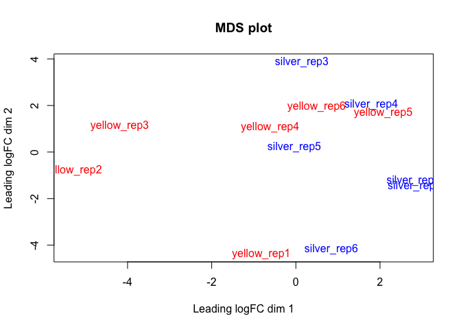

DE\_analysis\_eels
================
Ludovic Dutoit
3/11/2020

First, I go through the dataset, here it is:

``` r
library(tidyr)
library(DESeq2)
library(pheatmap)
library(stringr)
library(ggplot2)
library(matrixStats)
library(pheatmap)
library(edgeR)
library("RColorBrewer")

counts=read.csv("~/Trinity_trans.isoform.counts.matrix", sep="", head=T)
head(counts)
```

    ##                           silver_rep1 silver_rep2 silver_rep3 silver_rep4
    ## TRINITY_DN13198_c0_g1_i9        2.055          33           0           0
    ## TRINITY_DN5595_c0_g1_i4         0.000           0           0           0
    ## TRINITY_DN64022_c0_g1_i1        1.000           1           1           1
    ## TRINITY_DN76306_c0_g1_i1        2.000           2           0           1
    ## TRINITY_DN112308_c0_g1_i1      15.000           4          10          17
    ## TRINITY_DN146125_c0_g1_i1       0.000           0           0           0
    ##                           silver_rep5 silver_rep6 yellow_rep1 yellow_rep2
    ## TRINITY_DN13198_c0_g1_i9       12.145           0      21.502          39
    ## TRINITY_DN5595_c0_g1_i4         0.000           0       0.000           0
    ## TRINITY_DN64022_c0_g1_i1        1.000           0       0.000           0
    ## TRINITY_DN76306_c0_g1_i1        0.000           0       0.000           0
    ## TRINITY_DN112308_c0_g1_i1       9.000          15       9.000          29
    ## TRINITY_DN146125_c0_g1_i1       0.000           0       0.000           5
    ##                           yellow_rep3 yellow_rep4 yellow_rep5 yellow_rep6
    ## TRINITY_DN13198_c0_g1_i9        4.959      93.021           0       0.000
    ## TRINITY_DN5595_c0_g1_i4         0.000       0.000           0     136.766
    ## TRINITY_DN64022_c0_g1_i1        0.000       0.000           0       1.000
    ## TRINITY_DN76306_c0_g1_i1        0.000       0.000           0       0.000
    ## TRINITY_DN112308_c0_g1_i1       9.000      34.000           5      28.000
    ## TRINITY_DN146125_c0_g1_i1       0.000       0.000           2       0.000

``` r
colnames(counts)
```

    ##  [1] "silver_rep1" "silver_rep2" "silver_rep3" "silver_rep4" "silver_rep5"
    ##  [6] "silver_rep6" "yellow_rep1" "yellow_rep2" "yellow_rep3" "yellow_rep4"
    ## [11] "yellow_rep5" "yellow_rep6"

``` r
######### Do the filtering
samples=cbind(colnames(counts),rep(c("silver","yellow"),each=6))
rownames(samples)<-samples[,1]
samples=as.data.frame(samples[,-1])
colnames(samples)<-"treatment"
treatment <- factor(rep(c("silver","yellow"),each=6))
```

### Basic filtering

``` r
des <- model.matrix(~treatment)
dge <- DGEList(counts=counts) 
keep <- filterByExpr(counts, des) # inside function of limma aware of the design to remove rad counts
dge <- dge[keep,keep.lib.sizes=FALSE]

cutoff <- 4
keep <- !(apply(cpm(dge), 1, mean) < cutoff) # remove gene with average cpm below 2
dge <- dge[keep,keep.lib.sizes=FALSE]

dge<- calcNormFactors(dge)
print("After filtering, kept a matrix of X genes by Y samples:")
```

    ## [1] "After filtering, kept a matrix of X genes by Y samples:"

``` r
dim(dge)
```

    ## [1] 24725    12

### Some visualisation after basic filtering

``` r
###all counts
logCounts = log2(as.matrix(counts)+ 0.5)
boxplot(as.matrix(logCounts) ~ col(logCounts),names=c("s1","s2","s3","s4","s5","s6","y1","y2","y3","y4","y5","y6"),main= "log Raw counts",sub="Y has a lot of transcripts with low counts")
```


``` r
###dge
logCounts = log2(as.matrix(dge)+ 0.5)
boxplot(as.matrix(logCounts) ~ col(logCounts),names=c("s1","s2","s3","s4","s5","s6","y1","y2","y3","y4","y5","y6"),main= "log filtered counts",sub="Those low yellow transcripts are filtered out")
```


``` r
print(paste(c("number of transcripts:"," before filtering ",dim(counts)[1]," after filtering ",dim(dge)[1])))
```

    ## [1] "number of transcripts:" " before filtering "     "282469"                
    ## [4] " after filtering "      "24725"

``` r
print("While we get rid of most transcripts (lowly expressed), we keep a high proportion of all reads per samples")
```

    ## [1] "While we get rid of most transcripts (lowly expressed), we keep a high proportion of all reads per samples"

``` r
apply(dge,2,sum)/apply(counts,2,sum)
```

    ## silver_rep1 silver_rep2 silver_rep3 silver_rep4 silver_rep5 silver_rep6 
    ##   0.8969026   0.8989267   0.8945996   0.9019418   0.9010823   0.9030584 
    ## yellow_rep1 yellow_rep2 yellow_rep3 yellow_rep4 yellow_rep5 yellow_rep6 
    ##   0.9191603   0.9322053   0.9290142   0.9238717   0.9200671   0.9160665

### DE analysis

``` r
logCPM <- cpm(dge, log=TRUE)
design <- model.matrix(~samples$treatment)

v <- voom(dge, design, plot=TRUE, normalize="quantile")
```


``` r
plotMDS(v, labels=colnames(v), main="MDS plot", col=rep(c("blue","red"),each=6))
```



``` r
fit <- lmFit(v, design)
fit <- eBayes(fit, trend=TRUE)
results<-topTable(fit, coef=ncol(design),n=Inf)
sum(results$adj.P.Val<0.05)
```

    ## [1] 2878

``` r
##Table of DE genes
DE_counts<-dge[results$adj.P.Val<0.05,]
DE_results<-results[results$adj.P.Val<0.05,]


#positive means more in yellow
#negative means more in gray

length(which(DE_results$logFC<0))
```

    ## [1] 1481

``` r
length(which(DE_results$logFC>0))
```

    ## [1] 1397

``` r
mean(DE_results$logFC[which(DE_results$logFC>0)])
```

    ## [1] 0.829659

``` r
mean(DE_results$logFC[which(DE_results$logFC<0)])
```

    ## [1] -0.9269828

``` r
###Volcano plot
plot(results$logFC,-log(results$adj.P.Val),pch=10,cex=0.1)
points(DE_results$logFC,-log(DE_results$adj.P.Val),pch=10,cex=0.1,col="red")
```


``` r
plot(results$AveExpr,results$logFC,pch=10,cex=0.1)
points(DE_results$AveExpr,DE_results$logFC,pch=10,cex=0.1,col="red")
```


``` r
#Look at gene express only in one of the two, look at extreme genes ... on top of volcano plot. Those ref ones have low variance within, higher between
#Should I filter more?
```
