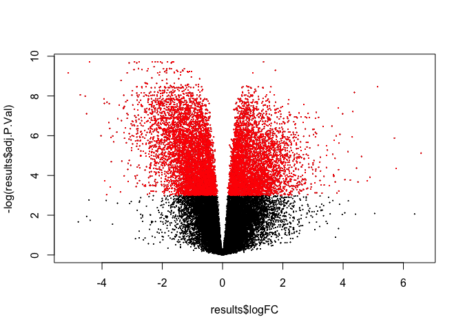
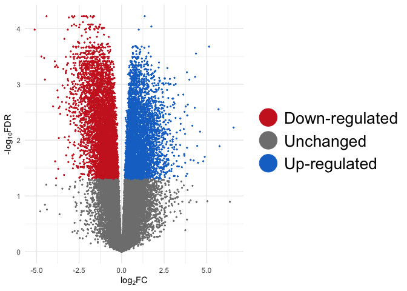
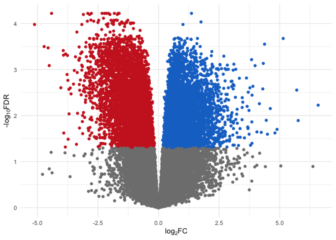

DE\_analysis\_eels
================
Ludovic Dutoit
3/11/2020

First, I go through the dataset, here it is:

``` r
library(tidyr)
library(DESeq2)
library(pheatmap)
library(stringr)
library(ggplot2)
library(matrixStats)
library(pheatmap)
library(edgeR)
library("RColorBrewer")

counts=read.csv("results_files/RSEM_gene_counts.txt", sep="", head=T)
head(counts)
```

    ##                        silver_rep1 silver_rep2 silver_rep3 silver_rep4
    ## TRINITY_DN0_c0_g1             6861     6563.66     5170.09        6797
    ## TRINITY_DN100000_c0_g1           2        1.00        3.00           0
    ## TRINITY_DN100001_c0_g1           0        0.00        0.00           1
    ## TRINITY_DN100002_c0_g1           2        0.00        0.00           0
    ## TRINITY_DN100003_c0_g1           1        2.00        2.00           0
    ## TRINITY_DN100004_c0_g1           5        2.00        2.00           2
    ##                        silver_rep5 silver_rep6 yellow_rep1 yellow_rep2
    ## TRINITY_DN0_c0_g1          6089.59     6081.01     5431.87        2569
    ## TRINITY_DN100000_c0_g1        1.00        3.00        0.00           0
    ## TRINITY_DN100001_c0_g1        0.00        1.00        0.00           1
    ## TRINITY_DN100002_c0_g1        0.00        0.00        1.00           0
    ## TRINITY_DN100003_c0_g1        0.00        1.00        0.00           1
    ## TRINITY_DN100004_c0_g1        5.00        5.00        2.00           7
    ##                        yellow_rep3 yellow_rep4 yellow_rep5 yellow_rep6
    ## TRINITY_DN0_c0_g1             3088        3603        4274        5017
    ## TRINITY_DN100000_c0_g1           0           5           0           0
    ## TRINITY_DN100001_c0_g1           0           0           0           0
    ## TRINITY_DN100002_c0_g1           0           0           0           0
    ## TRINITY_DN100003_c0_g1           2           0           1           1
    ## TRINITY_DN100004_c0_g1           3           8           6          10

``` r
colnames(counts)
```

    ##  [1] "silver_rep1" "silver_rep2" "silver_rep3" "silver_rep4" "silver_rep5"
    ##  [6] "silver_rep6" "yellow_rep1" "yellow_rep2" "yellow_rep3" "yellow_rep4"
    ## [11] "yellow_rep5" "yellow_rep6"

``` r
######### Do the filtering
samples=cbind(colnames(counts),rep(c("silver","yellow"),each=6))
rownames(samples)<-samples[,1]
samples=as.data.frame(samples[,-1])
colnames(samples)<-"treatment"
treatment <- factor(rep(c("silver","yellow"),each=6))
```

### Basic filtering

``` r
des <- model.matrix(~treatment)
dge <- DGEList(counts=counts) 
keep <- filterByExpr(counts, des) # inside function of limma aware of the design to remove rad counts
dge <- dge[keep,keep.lib.sizes=FALSE]


dge<- calcNormFactors(dge)
print("After filtering, kept a matrix of X genes by Y samples:")
```

    ## [1] "After filtering, kept a matrix of X genes by Y samples:"

``` r
dim(dge) 
```

    ## [1] 32447    12

### Some visualisation after basic filtering

``` r
###all counts
logCounts = log2(as.matrix(counts)+ 0.5)
boxplot(as.matrix(logCounts) ~ col(logCounts),names=c("s1","s2","s3","s4","s5","s6","y1","y2","y3","y4","y5","y6"),main= "log Raw counts",sub="Y has a lot of transcripts with low counts",main="Counts before filtering")
```


``` r
###dge
logCounts = log2(as.matrix(dge)+ 0.5)
boxplot(as.matrix(logCounts) ~ col(logCounts),names=c("s1","s2","s3","s4","s5","s6","y1","y2","y3","y4","y5","y6"),main= "log filtered counts")
```


``` r
print(paste(c("number of transcripts:"," before filtering ",dim(counts)[1]," after filtering ",dim(dge)[1])))
```

    ## [1] "number of transcripts:" " before filtering "     "171620"                
    ## [4] " after filtering "      "32447"

``` r
print("While we get rid of most transcripts (lowly expressed), we keep a high proportion of all reads per samples")
```

    ## [1] "While we get rid of most transcripts (lowly expressed), we keep a high proportion of all reads per samples"

``` r
apply(dge,2,sum)/apply(counts,2,sum)
```

    ## silver_rep1 silver_rep2 silver_rep3 silver_rep4 silver_rep5 silver_rep6 
    ##   0.9913808   0.9916407   0.9918556   0.9926842   0.9923784   0.9922659 
    ## yellow_rep1 yellow_rep2 yellow_rep3 yellow_rep4 yellow_rep5 yellow_rep6 
    ##   0.9930030   0.9936932   0.9932939   0.9927278   0.9925403   0.9934591

### Basic stats post filtering

How many reads per gene? This is the distribution in 5% quantiles of number of reads per sample per gene

``` r
quantile(apply(dge$counts,1,sum)/12,seq(0,1,0.05))
```

    ##           0%           5%          10%          15%          20%          25% 
    ## 6.583333e+00 1.241667e+01 1.548000e+01 1.916667e+01 2.375050e+01 2.991667e+01 
    ##          30%          35%          40%          45%          50%          55% 
    ## 3.785683e+01 4.850000e+01 6.283333e+01 8.266783e+01 1.103333e+02 1.489417e+02 
    ##          60%          65%          70%          75%          80%          85% 
    ## 2.071957e+02 2.924917e+02 4.198758e+02 6.036175e+02 8.733327e+02 1.250425e+03 
    ##          90%          95%         100% 
    ## 1.980895e+03 3.443662e+03 1.084269e+06

Up to 1e6 (maybe rRNA, to check). It means the most expressed genes has 1mio/reads per sample

median is about ten.

Let's visualise it for the bottom 85% (up to 2000)

``` r
hist(apply(dge$counts,1,sum)/12,xlim=c(0,2000),breaks=100000,main="number of reads per gene per sample",xlab= "number of reads per sample",ylab= "frequency") # 32447 genes passing filtering
```


What are the most expressed genes above 1000000 per sample:

``` r
which(apply(dge$counts,1,sum)/12>1e6)
```

    ## TRINITY_DN2028_c0_g1 TRINITY_DN4587_c0_g1 
    ##                10912                21449

TRINITY\_DN2028\_c0\_g1 sequence matches Anguilla japonica eZPCa mRNA for egg envelope protein, complete cds:

    >TRINITY_DN2028_c0_g1_i11 RANDOMLY PICKED ISOFORM
    TACAGTAACCTCATGATCCATGCAGTCTGGCTACTGCATTGAAAGCTGCTTGGGGGGGGGGGGGAAATCCAAAACTTGATATAATGGAAGGTACAGAAATGTGGACTCAGAACACAATGATCTGGACAGCACGTTTTGAGGCACTTCAAGTTTTATTCAAAAATCCCCACCCAGTTACAGGACAGGTTTGTAGCGTCTCCACATCAGCACCATCCCCAGCGCAATGATGCAGACCAGTCCCACTGCAGCCATCACTCCAGCCATAAATACCACCTTAGAGGCACCTTCTGCTTGGTGATCTGCATTCAGAGGGCTGATGGACTCAGGTACATCTTTGACAGCCTCCTGGACAACAATTGGGCCTAGGACTGCGCCACCCTCATACTGTATGCCTGTATTCACACTCCTTATCTTCCTCCCACCACAGCTGGTGTCACAGCAGCTACATGCCTGGTCATTCCCAGATGCCTCAATCCACCGTTCCTTCCCAAGAGGAAATGAGCAAGCCTTCCCTTCTGAATCTGGCAAAGCTGCAGTAGCCTTCAGATAGCAGAAAATGTAGACAGCACTCCTGGTCTCCTGGGCAAACCTGAAGGCATCCAGCTGAAGTTGCAGCTTGTCGTCCTGTACCCTTGACAGGAACTGGGAGCGGGAGTTGGTCAGCTTGGAATCCATTAGACACCCCTTGTTCTCAATGAAAGCATATCTGGGGACAGCGTTCATGTCAGGGTCCAAAGTAGCTATACAGGTATCCACAAACACGCGGAGGGGCACGTGGTTGGCCTGGACCACTGAAGCCTCAATGTTGATGAGGTCACCCAGGAAGAACACCGTGGATGTCCTCTCCGTCTGCCAGTTATCAGCCATGAGCCTTAATGAAAATACAAGGAGGTCCTCAGCAGAAAGGGTGGAGTGGTAGGGGATCCAGGTTGGCTTCAGGGCATTACTGCTCACGTTATGCAGCCTCATGTAATGACACTGGATGCCCACCACTGCACTTGATGTCCTAATGATGGGAGTGGCACCAAGTGCTTTAGGTTGGTAGTTCAGGGTGAAGGTGTACACTAGGGAGTCAGCAGTCATTGCAAGCACACTGCCACAGCTGTGCAGCTCAGTCTCAAATAGAAGCACTTGGGTAGACCCATCCAGGTCAACAGGTCCGCAGCCTCCTAGGGTGATGTCAGTGGGCTGGATAAGGTGGCCGATGCCAAGCAGGTCCATATCTACTTCCAACTGAACAGAGCTTTCCCCACAGTGAGCCTTCACAGCATCTGGCTTAGGTGTAGGAGGTTCCACTGGAATTGTTGACC

TRINITY\_DN4587 matches PREDICTED: Anguilla anguilla zona pellucida sperm-binding protein 4-like (LOC118223083), mRNA

    >TRINITY_DN4587_c0_g1_i12 len=1019 path=[4:0-44 6:45-214 7:215-228 8:229-252 9:253-342 11:343-487 12:488-566 14:567-597 15:598-681 17:682-711 19:712-968 20:969-1018]
    ACTTCACTGTGAAGCCTCTGGTCGGTGGCTGTAAGCTCCGTATTGGTCAGGACTACAGGCTTACTGGAAACCACAGCCTTTTCCTCAGGGGACCGCTTGCCTACAGGAGCAATTGACCTTCTTTGCTTTCCACTGCTGCACCGCTGTTCACAGCGATCGGTAGCAGAGGGGTGGCAAACTGCCGTGCTACAGTGGATGAACACCGTTTCCTTCAGTGGAACGAAGGATTCAGGATCCACAAAGGTAAACATCTGCACAATAAACCGCTTGTAGTGACTGGGGAAGAGAAGTCCAGAAGAGGCATCTACAGGAACCAAGGATGTCTGGTAGCGGTCATCACGGTAGGGAGACCCATCAACCAAAAGGCTCCACTGGGGTAGGCTGAGGGGGCTGGAGGTTGATGTAGCCCAGCAGTGTTCCAGAAGCAGGACAAGGTTTGGGTCAGTCCTCTCCAAGATCCGCACTTCCACATACACAGGTTCCCGTAGCACCTTGGTCACGGGGTAGTCCGCATCTCCGTAGTAGTCGCTGTACACAGCATCAGCACATCCACTTGCTCCTTTGGAGTCACATTGACCACTAGCCAGTCTGAGCTCAATGCGAAGGGGCCCTGGAGCAGCTACTGGAAGGGGAGGCGGCACTGTATTCACCTCAGCTACTAAAGAAACCACAGCACTGCCAGAATACCTGCACTGGAAGGACAGCTCATAAATACTGTCCCTTGTGATGGAACCTAAAGGGCCAACGCCCACTTCATATGTGGAGGACATCTTGTTCTCATAGATCACGTAATCCCCTTCCACCCTCACTGTGGTTCCACAGTCACTGACTGGAAATTGGAAGACCGCAAAAGCAGGAGAGGCACTAACAGGACCACAGTAACCGCCACTGGGGCCCTCCAGCAAGTTCACAGAAGGAAGGTCAAGCAGAGGCAAGGTGGCGGCTCTGGACACTACAACCATGAACTGGCCATCCCGGAGACAGTGGACAGTAACTTCATTTGCATAATAGCACTGTTG

### DE analysis

``` r
logCPM <- cpm(dge, log=TRUE)
design <- model.matrix(~samples$treatment)

v <- voom(dge, design, plot=TRUE, normalize="quantile")
```


``` r
plotMDS(v, labels=c("s1","s2","s3","s4","s5","s6","y1","y2","y3","y4","y5","y6"),main="MDS plot", col=rep(c("gray","gold"),each=6))
```



``` r
fit <- lmFit(v, design)
fit <- eBayes(fit, trend=TRUE)
results<-topTable(fit, coef=ncol(design),n=Inf)

sum(results$adj.P.Val<0.05)
```

    ## [1] 10348

``` r
##Table of DE genes

#DE_counts are the counts for the DE 
DE_results<-results[results$adj.P.Val<0.05,] # DE_results are only the significant genes(p-value, log Fold-change,,,)
 
DE_counts<-dge[which(rownames(dge)%in%rownames(results)),]$counts #counts for significant genes


#positive means more in yellow
#negative means more in gray


##Overexpressed and underexpressed in general?
length(which(DE_results$logFC<(-1))) # how many genes under expressed in yellow  or more
```

    ## [1] 2851

``` r
length(which(DE_results$logFC>1)) # how many genes over expressed in yellow
```

    ## [1] 2027

``` r
##Overexpressed and underexpressed  by a actor 2 or more
length(which(DE_results$logFC<(-1))) # how many genes under expressed in yellow by a 
```

    ## [1] 2851

``` r
length(which(DE_results$logFC>1)) # how many genes over expressed in yellow
```

    ## [1] 2027

``` r
###Volcano plot (relationship between Log Fold Change and -value)
plot(results$logFC,-log(results$adj.P.Val),pch=10,cex=0.1) 
points(DE_results$logFC,-log(DE_results$adj.P.Val),pch=10,cex=0.1,col="red")
```



``` r
plot(results$AveExpr,results$logFC,pch=10,cex=0.1)
points(DE_results$AveExpr,DE_results$logFC,pch=10,cex=0.1,col="red")
```



Let's output those results as text tables that everyone can play with ( in excel or other). I saved it as [DE\_results.txt](DE_results.txt)

``` r
final_results_DE<-merge(DE_results,DE_counts,by=0)
colnames(final_results_DE)[1]<-"GeneID"
write.table(final_results_DE,"DE_results.txt",row.names=T,col.names=T,sep="\t")
```

we also output the 32447 genes representing the whole genome for the GOSeq analysis:

``` r
write(rownames(dge$counts),"backgroundGO.txt",sep="\n")
write(rownames(dge$counts),"backgroundALLGO.txt",sep="\n")
```

And finally we upload the results for ALL the genes:

``` r
final_results<-merge(results,dge$counts,by=0)
colnames(final_results)[1]<-"GeneID"
write.table(final_results,"ALLgenes_results.txt",row.names=T,col.names=T,sep="\t")
```

### Saving data for plotting\_genes.R

``` r
save(counts,results,file="countsand_logFCforplottingGene.RData")
```
