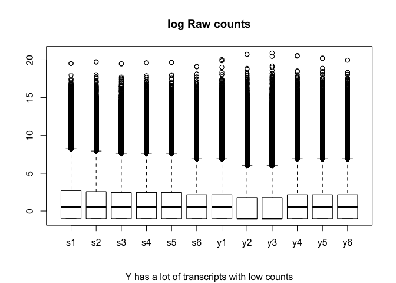
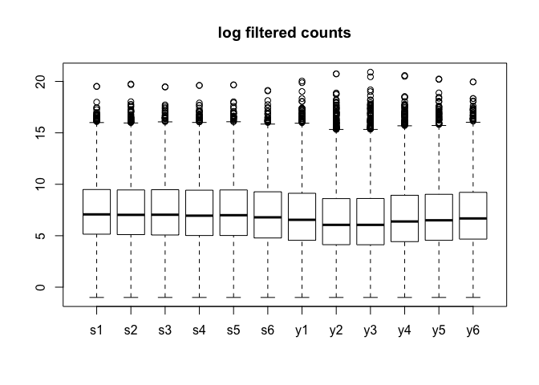
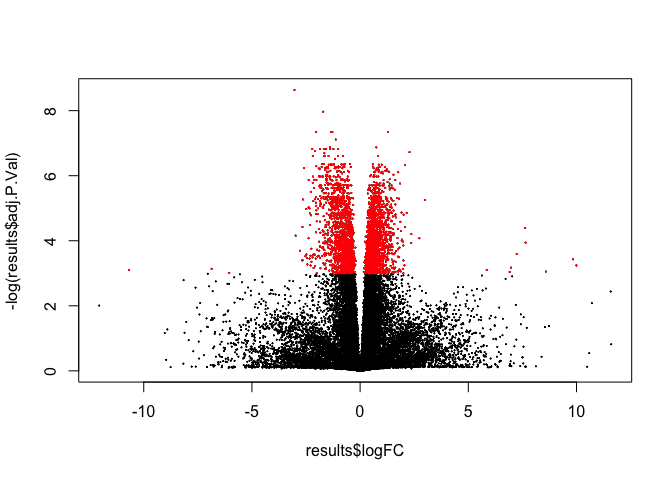
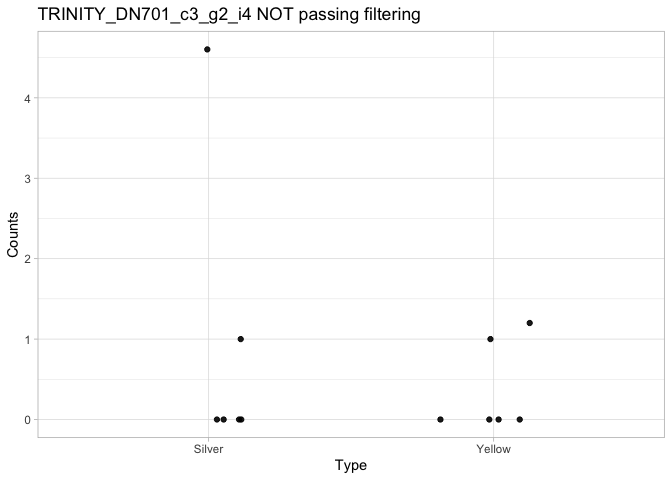
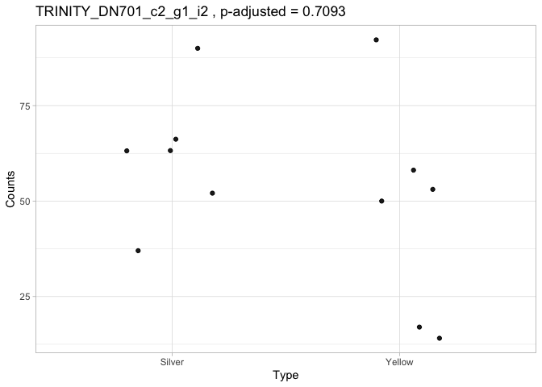

DE\_analysis\_eels
================
Ludovic Dutoit
3/11/2020

First, I go through the dataset, here it is:

    ##                           silver_rep1 silver_rep2 silver_rep3 silver_rep4
    ## TRINITY_DN13198_c0_g1_i9        2.055          33           0           0
    ## TRINITY_DN5595_c0_g1_i4         0.000           0           0           0
    ## TRINITY_DN64022_c0_g1_i1        1.000           1           1           1
    ## TRINITY_DN76306_c0_g1_i1        2.000           2           0           1
    ## TRINITY_DN112308_c0_g1_i1      15.000           4          10          17
    ## TRINITY_DN146125_c0_g1_i1       0.000           0           0           0
    ##                           silver_rep5 silver_rep6 yellow_rep1 yellow_rep2
    ## TRINITY_DN13198_c0_g1_i9       12.145           0      21.502          39
    ## TRINITY_DN5595_c0_g1_i4         0.000           0       0.000           0
    ## TRINITY_DN64022_c0_g1_i1        1.000           0       0.000           0
    ## TRINITY_DN76306_c0_g1_i1        0.000           0       0.000           0
    ## TRINITY_DN112308_c0_g1_i1       9.000          15       9.000          29
    ## TRINITY_DN146125_c0_g1_i1       0.000           0       0.000           5
    ##                           yellow_rep3 yellow_rep4 yellow_rep5 yellow_rep6
    ## TRINITY_DN13198_c0_g1_i9        4.959      93.021           0       0.000
    ## TRINITY_DN5595_c0_g1_i4         0.000       0.000           0     136.766
    ## TRINITY_DN64022_c0_g1_i1        0.000       0.000           0       1.000
    ## TRINITY_DN76306_c0_g1_i1        0.000       0.000           0       0.000
    ## TRINITY_DN112308_c0_g1_i1       9.000      34.000           5      28.000
    ## TRINITY_DN146125_c0_g1_i1       0.000       0.000           2       0.000

    ##  [1] "silver_rep1" "silver_rep2" "silver_rep3" "silver_rep4" "silver_rep5"
    ##  [6] "silver_rep6" "yellow_rep1" "yellow_rep2" "yellow_rep3" "yellow_rep4"
    ## [11] "yellow_rep5" "yellow_rep6"

### Basic filtering

``` r
des <- model.matrix(~treatment)
dge <- DGEList(counts=counts) 
keep <- filterByExpr(counts, des) # inside function of limma aware of the design to remove rad counts
dge <- dge[keep,keep.lib.sizes=FALSE]

cutoff <- 2
keep <- !(apply(cpm(dge), 1, mean) < cutoff) # remove gene with average cpm below 2
dge <- dge[keep,keep.lib.sizes=FALSE]

dge<- calcNormFactors(dge)
print("After filtering, kept a matrix of X genes by Y samples:")
```

    ## [1] "After filtering, kept a matrix of X genes by Y samples:"

``` r
dim(dge)
```

    ## [1] 33358    12

### Some visualisation after basic filtering

``` r
###all counts
logCounts = log2(as.matrix(counts)+ 0.5)
boxplot(as.matrix(logCounts) ~ col(logCounts),names=c("s1","s2","s3","s4","s5","s6","y1","y2","y3","y4","y5","y6"),main= "log Raw counts",sub="Y has a lot of transcripts with low counts")
```



``` r
###dge
logCounts = log2(as.matrix(dge)+ 0.5)
boxplot(as.matrix(logCounts) ~ col(logCounts),names=c("s1","s2","s3","s4","s5","s6","y1","y2","y3","y4","y5","y6"),main= "log filtered counts",sub="Those low yellow transcripts are filtered out")
```



``` r
print(paste(c("number of transcripts:"," before filtering ",dim(counts)[1]," after filtering ",dim(dge)[1])))
```

    ## [1] "number of transcripts:" " before filtering "    
    ## [3] "282469"                 " after filtering "     
    ## [5] "33358"

``` r
print("While we get rid of most transcripts (lowly expressed), we keep a high proportion of all reads per samples")
```

    ## [1] "While we get rid of most transcripts (lowly expressed), we keep a high proportion of all reads per samples"

``` r
apply(dge,2,sum)/apply(counts,2,sum)
```

    ## silver_rep1 silver_rep2 silver_rep3 silver_rep4 silver_rep5 silver_rep6 
    ##   0.9245346   0.9259348   0.9221067   0.9281084   0.9279552   0.9295059 
    ## yellow_rep1 yellow_rep2 yellow_rep3 yellow_rep4 yellow_rep5 yellow_rep6 
    ##   0.9408187   0.9503100   0.9470457   0.9438731   0.9412660   0.9384993

### DE analysis

``` r
logCPM <- cpm(dge, log=TRUE)
design <- model.matrix(~samples$treatment)

v <- voom(dge, design, plot=TRUE, normalize="quantile")
```


``` r
plotMDS(v, labels=colnames(v), main="MDS plot", col=rep(c("blue","red"),each=6))
```


``` r
fit <- lmFit(v, design)
fit <- eBayes(fit, trend=TRUE)
results<-topTable(fit, coef=ncol(design),n=Inf)
sum(results$adj.P.Val<0.05)
```

    ## [1] 3170

``` r
##Table of DE genes
DE_counts<-dge[results$adj.P.Val<0.05,]
DE_results<-results[results$adj.P.Val<0.05,]


#positive means more in yellow
#negative means more in gray

length(which(DE_results$logFC<0))
```

    ## [1] 1716

``` r
length(which(DE_results$logFC>0))
```

    ## [1] 1454

``` r
mean(DE_results$logFC[which(DE_results$logFC>0)])
```

    ## [1] 0.9316945

``` r
mean(DE_results$logFC[which(DE_results$logFC<0)])
```

    ## [1] -1.082202

``` r
###Volcano plot
plot(results$logFC,-log(results$adj.P.Val),pch=10,cex=0.1)
points(DE_results$logFC,-log(DE_results$adj.P.Val),pch=10,cex=0.1,col="red")
```



``` r
plot(results$AveExpr,results$logFC,pch=10,cex=0.1)
points(DE_results$AveExpr,DE_results$logFC,pch=10,cex=0.1,col="red")
```


``` r
#Look at gene express only in one of the two, look at extreme genes ... on top of volcano plot. Those ref ones have low variance within, higher between
#Should I filter more?
```

``` r
library(ggplot2)
sub_counts<-counts[grep("TRINITY_DN701_",rownames(counts)),]
type = as.factor(rep(c("Silver","Yellow"),each=6))
color = rep(c("lightslategray","yellow"),each=6)

for (i in 1:dim(sub_counts)[1]){
  print(sub_counts[i,])
  transcript_name<-(rownames(sub_counts[i,]))
  if(transcript_name%in%rownames(results)){                     title_bit<-paste(transcript_name,", p-adjusted =",round(      results$adj.P.Val[which(rownames(results)==transcript_name)],4))}else{title_bit<-paste(transcript_name,"NOT passing filtering")}
  transcript<-data.frame(Counts= as.numeric(sub_counts[i,]),Type =type,color=color)
  x<-ggplot(data = transcript, mapping = aes(x = Type, y = Counts)) +  
    geom_jitter(alpha = 0.9, height=0,width=0.2) + theme_light() +ggtitle(title_bit)
  plot(x)
  }
```

    ##                         silver_rep1 silver_rep2 silver_rep3 silver_rep4
    ## TRINITY_DN701_c1_g1_i16    4519.931    5219.842    4703.053    5205.974
    ##                         silver_rep5 silver_rep6 yellow_rep1 yellow_rep2
    ## TRINITY_DN701_c1_g1_i16    4029.531     4687.81    5332.336    3955.774
    ##                         yellow_rep3 yellow_rep4 yellow_rep5 yellow_rep6
    ## TRINITY_DN701_c1_g1_i16    4960.771     2606.41     5454.35    5234.692


    ##                        silver_rep1 silver_rep2 silver_rep3 silver_rep4
    ## TRINITY_DN701_c3_g2_i4           0           0           0       4.602
    ##                        silver_rep5 silver_rep6 yellow_rep1 yellow_rep2
    ## TRINITY_DN701_c3_g2_i4           1           0           0           0
    ##                        yellow_rep3 yellow_rep4 yellow_rep5 yellow_rep6
    ## TRINITY_DN701_c3_g2_i4           0         1.2           0           1



    ##                        silver_rep1 silver_rep2 silver_rep3 silver_rep4
    ## TRINITY_DN701_c3_g1_i3           0           0      13.073       8.047
    ##                        silver_rep5 silver_rep6 yellow_rep1 yellow_rep2
    ## TRINITY_DN701_c3_g1_i3           0           0      11.415           0
    ##                        yellow_rep3 yellow_rep4 yellow_rep5 yellow_rep6
    ## TRINITY_DN701_c3_g1_i3        3.42           0       1.713           5


    ##                        silver_rep1 silver_rep2 silver_rep3 silver_rep4
    ## TRINITY_DN701_c1_g1_i6    9144.952    12131.34    12217.42    12217.96
    ##                        silver_rep5 silver_rep6 yellow_rep1 yellow_rep2
    ## TRINITY_DN701_c1_g1_i6    11190.78     10140.3    11064.28    8972.461
    ##                        yellow_rep3 yellow_rep4 yellow_rep5 yellow_rep6
    ## TRINITY_DN701_c1_g1_i6     11023.5    12583.43    15504.52    15218.61


    ##                        silver_rep1 silver_rep2 silver_rep3 silver_rep4
    ## TRINITY_DN701_c2_g2_i3    1113.678     1180.62    1091.576     845.249
    ##                        silver_rep5 silver_rep6 yellow_rep1 yellow_rep2
    ## TRINITY_DN701_c2_g2_i3     932.043     744.242     560.497     126.946
    ##                        yellow_rep3 yellow_rep4 yellow_rep5 yellow_rep6
    ## TRINITY_DN701_c2_g2_i3     129.232     419.064     490.534     570.831


    ##                        silver_rep1 silver_rep2 silver_rep3 silver_rep4
    ## TRINITY_DN701_c3_g2_i3           0           0           0           0
    ##                        silver_rep5 silver_rep6 yellow_rep1 yellow_rep2
    ## TRINITY_DN701_c3_g2_i3           0           0       2.132           0
    ##                        yellow_rep3 yellow_rep4 yellow_rep5 yellow_rep6
    ## TRINITY_DN701_c3_g2_i3           0           0           0           2


    ##                        silver_rep1 silver_rep2 silver_rep3 silver_rep4
    ## TRINITY_DN701_c3_g1_i4      12.303       17.92      24.131      11.459
    ##                        silver_rep5 silver_rep6 yellow_rep1 yellow_rep2
    ## TRINITY_DN701_c3_g1_i4     108.588       7.714       4.065      17.957
    ##                        yellow_rep3 yellow_rep4 yellow_rep5 yellow_rep6
    ## TRINITY_DN701_c3_g1_i4       1.928      28.314       1.693           0


    ##                        silver_rep1 silver_rep2 silver_rep3 silver_rep4
    ## TRINITY_DN701_c0_g1_i7      25.365           0           0           0
    ##                        silver_rep5 silver_rep6 yellow_rep1 yellow_rep2
    ## TRINITY_DN701_c0_g1_i7           0           0           0           0
    ##                        yellow_rep3 yellow_rep4 yellow_rep5 yellow_rep6
    ## TRINITY_DN701_c0_g1_i7           0           0           0           0


    ##                        silver_rep1 silver_rep2 silver_rep3 silver_rep4
    ## TRINITY_DN701_c0_g1_i3           0           0           0           0
    ##                        silver_rep5 silver_rep6 yellow_rep1 yellow_rep2
    ## TRINITY_DN701_c0_g1_i3           0           0           0           0
    ##                        yellow_rep3 yellow_rep4 yellow_rep5 yellow_rep6
    ## TRINITY_DN701_c0_g1_i3           0           0           0           0


    ##                        silver_rep1 silver_rep2 silver_rep3 silver_rep4
    ## TRINITY_DN701_c6_g1_i1          27          46          36          41
    ##                        silver_rep5 silver_rep6 yellow_rep1 yellow_rep2
    ## TRINITY_DN701_c6_g1_i1          45          41          21           8
    ##                        yellow_rep3 yellow_rep4 yellow_rep5 yellow_rep6
    ## TRINITY_DN701_c6_g1_i1          26          35          18          30


    ##                        silver_rep1 silver_rep2 silver_rep3 silver_rep4
    ## TRINITY_DN701_c0_g1_i4       136.7           0           0     145.222
    ##                        silver_rep5 silver_rep6 yellow_rep1 yellow_rep2
    ## TRINITY_DN701_c0_g1_i4     235.087           0     152.433      41.387
    ##                        yellow_rep3 yellow_rep4 yellow_rep5 yellow_rep6
    ## TRINITY_DN701_c0_g1_i4           0           0      105.58           0


    ##                         silver_rep1 silver_rep2 silver_rep3 silver_rep4
    ## TRINITY_DN701_c1_g1_i14     786.478     459.681     611.354     834.753
    ##                         silver_rep5 silver_rep6 yellow_rep1 yellow_rep2
    ## TRINITY_DN701_c1_g1_i14     626.743     699.505     660.382           0
    ##                         yellow_rep3 yellow_rep4 yellow_rep5 yellow_rep6
    ## TRINITY_DN701_c1_g1_i14     1163.08     993.159     810.417     675.445


    ##                        silver_rep1 silver_rep2 silver_rep3 silver_rep4
    ## TRINITY_DN701_c1_g1_i4    9486.591     4916.29    5352.041    4838.654
    ##                        silver_rep5 silver_rep6 yellow_rep1 yellow_rep2
    ## TRINITY_DN701_c1_g1_i4    4994.319     5147.76    4566.205    4097.753
    ##                        yellow_rep3 yellow_rep4 yellow_rep5 yellow_rep6
    ## TRINITY_DN701_c1_g1_i4    5485.438    6106.164     3363.47    4676.613


    ##                        silver_rep1 silver_rep2 silver_rep3 silver_rep4
    ## TRINITY_DN701_c1_g1_i9    5081.343    6192.761    3015.789    2263.948
    ##                        silver_rep5 silver_rep6 yellow_rep1 yellow_rep2
    ## TRINITY_DN701_c1_g1_i9    3209.332    4168.827    3152.701    4860.289
    ##                        yellow_rep3 yellow_rep4 yellow_rep5 yellow_rep6
    ## TRINITY_DN701_c1_g1_i9    1792.911    2303.266    2480.966    3296.242


    ##                        silver_rep1 silver_rep2 silver_rep3 silver_rep4
    ## TRINITY_DN701_c0_g1_i5           0           0           0           0
    ##                        silver_rep5 silver_rep6 yellow_rep1 yellow_rep2
    ## TRINITY_DN701_c0_g1_i5      13.042      22.297      29.416           0
    ##                        yellow_rep3 yellow_rep4 yellow_rep5 yellow_rep6
    ## TRINITY_DN701_c0_g1_i5           0           0      12.596           0


    ##                        silver_rep1 silver_rep2 silver_rep3 silver_rep4
    ## TRINITY_DN701_c3_g1_i1           0           0      95.147      16.232
    ##                        silver_rep5 silver_rep6 yellow_rep1 yellow_rep2
    ## TRINITY_DN701_c3_g1_i1           0           0      83.521           0
    ##                        yellow_rep3 yellow_rep4 yellow_rep5 yellow_rep6
    ## TRINITY_DN701_c3_g1_i1       15.56      27.226      19.218      21.898


    ##                        silver_rep1 silver_rep2 silver_rep3 silver_rep4
    ## TRINITY_DN701_c2_g1_i1     436.801     257.851         432     372.784
    ##                        silver_rep5 silver_rep6 yellow_rep1 yellow_rep2
    ## TRINITY_DN701_c2_g1_i1     521.934         231         350     253.926
    ##                        yellow_rep3 yellow_rep4 yellow_rep5 yellow_rep6
    ## TRINITY_DN701_c2_g1_i1         236     561.937     397.905     239.784


    ##                        silver_rep1 silver_rep2 silver_rep3 silver_rep4
    ## TRINITY_DN701_c0_g1_i2    3627.163      10.142           0           0
    ##                        silver_rep5 silver_rep6 yellow_rep1 yellow_rep2
    ## TRINITY_DN701_c0_g1_i2           0       9.284    2693.742           0
    ##                        yellow_rep3 yellow_rep4 yellow_rep5 yellow_rep6
    ## TRINITY_DN701_c0_g1_i2           0           0      26.761      28.975


    ##                        silver_rep1 silver_rep2 silver_rep3 silver_rep4
    ## TRINITY_DN701_c1_g1_i3    8631.118    14817.18    6288.448     6883.79
    ##                        silver_rep5 silver_rep6 yellow_rep1 yellow_rep2
    ## TRINITY_DN701_c1_g1_i3    9103.664     9703.86    8609.191    21017.32
    ##                        yellow_rep3 yellow_rep4 yellow_rep5 yellow_rep6
    ## TRINITY_DN701_c1_g1_i3    1545.682    9388.935    9167.737    9247.273


    ##                        silver_rep1 silver_rep2 silver_rep3 silver_rep4
    ## TRINITY_DN701_c3_g2_i1           0           0           0           0
    ##                        silver_rep5 silver_rep6 yellow_rep1 yellow_rep2
    ## TRINITY_DN701_c3_g2_i1           0           0      11.243           0
    ##                        yellow_rep3 yellow_rep4 yellow_rep5 yellow_rep6
    ## TRINITY_DN701_c3_g2_i1           0           0           0           0


    ##                        silver_rep1 silver_rep2 silver_rep3 silver_rep4
    ## TRINITY_DN701_c2_g2_i1       5.073       27.38      19.424      13.586
    ##                        silver_rep5 silver_rep6 yellow_rep1 yellow_rep2
    ## TRINITY_DN701_c2_g2_i1       4.822      26.758      25.773     139.054
    ##                        yellow_rep3 yellow_rep4 yellow_rep5 yellow_rep6
    ## TRINITY_DN701_c2_g2_i1      41.768       17.63      19.984      17.233


    ##                        silver_rep1 silver_rep2 silver_rep3 silver_rep4
    ## TRINITY_DN701_c0_g1_i1    3582.675     7488.07    7397.038    6570.451
    ##                        silver_rep5 silver_rep6 yellow_rep1 yellow_rep2
    ## TRINITY_DN701_c0_g1_i1    6705.389     6259.16    2739.739    1643.764
    ##                        yellow_rep3 yellow_rep4 yellow_rep5 yellow_rep6
    ## TRINITY_DN701_c0_g1_i1    1581.915    3277.633    4350.434    5414.251


    ##                         silver_rep1 silver_rep2 silver_rep3 silver_rep4
    ## TRINITY_DN701_c1_g1_i13    23837.46    26636.78    36739.84    38027.83
    ##                         silver_rep5 silver_rep6 yellow_rep1 yellow_rep2
    ## TRINITY_DN701_c1_g1_i13    29598.49     28359.9    36451.53    13119.99
    ##                         yellow_rep3 yellow_rep4 yellow_rep5 yellow_rep6
    ## TRINITY_DN701_c1_g1_i13    40879.59    35978.59    39667.46    38940.07


    ##                        silver_rep1 silver_rep2 silver_rep3 silver_rep4
    ## TRINITY_DN701_c5_g1_i1         463         424     404.152     394.164
    ##                        silver_rep5 silver_rep6 yellow_rep1 yellow_rep2
    ## TRINITY_DN701_c5_g1_i1         381         355         296     205.606
    ##                        yellow_rep3 yellow_rep4 yellow_rep5 yellow_rep6
    ## TRINITY_DN701_c5_g1_i1         248     299.169         254         393


    ##                        silver_rep1 silver_rep2 silver_rep3 silver_rep4
    ## TRINITY_DN701_c9_g1_i1         309         298     329.008         377
    ##                        silver_rep5 silver_rep6 yellow_rep1 yellow_rep2
    ## TRINITY_DN701_c9_g1_i1         487         435         508         357
    ##                        yellow_rep3 yellow_rep4 yellow_rep5 yellow_rep6
    ## TRINITY_DN701_c9_g1_i1         309         341         338         470


    ##                        silver_rep1 silver_rep2 silver_rep3 silver_rep4
    ## TRINITY_DN701_c3_g2_i2           0          30           0      69.398
    ##                        silver_rep5 silver_rep6 yellow_rep1 yellow_rep2
    ## TRINITY_DN701_c3_g2_i2           0           0           0           0
    ##                        yellow_rep3 yellow_rep4 yellow_rep5 yellow_rep6
    ## TRINITY_DN701_c3_g2_i2           6         3.8           0           0


    ##                        silver_rep1 silver_rep2 silver_rep3 silver_rep4
    ## TRINITY_DN701_c2_g2_i2       8.249           0           0       6.164
    ##                        silver_rep5 silver_rep6 yellow_rep1 yellow_rep2
    ## TRINITY_DN701_c2_g2_i2      16.135           0      14.624           0
    ##                        yellow_rep3 yellow_rep4 yellow_rep5 yellow_rep6
    ## TRINITY_DN701_c2_g2_i2           0      72.306      14.481       9.936


    ##                        silver_rep1 silver_rep2 silver_rep3 silver_rep4
    ## TRINITY_DN701_c3_g1_i2      74.697       91.08           0      21.263
    ##                        silver_rep5 silver_rep6 yellow_rep1 yellow_rep2
    ## TRINITY_DN701_c3_g1_i2       1.412     138.286           0      16.043
    ##                        yellow_rep3 yellow_rep4 yellow_rep5 yellow_rep6
    ## TRINITY_DN701_c3_g1_i2      11.092       7.459      64.377      39.102


    ##                        silver_rep1 silver_rep2 silver_rep3 silver_rep4
    ## TRINITY_DN701_c0_g1_i6    1029.594     1383.26    1032.962    1082.327
    ##                        silver_rep5 silver_rep6 yellow_rep1 yellow_rep2
    ## TRINITY_DN701_c0_g1_i6    1061.483      592.26     619.598     186.849
    ##                        yellow_rep3 yellow_rep4 yellow_rep5 yellow_rep6
    ## TRINITY_DN701_c0_g1_i6     296.085     651.367     741.628     992.279


    ##                        silver_rep1 silver_rep2 silver_rep3 silver_rep4
    ## TRINITY_DN701_c1_g1_i8           0           0           0           0
    ##                        silver_rep5 silver_rep6 yellow_rep1 yellow_rep2
    ## TRINITY_DN701_c1_g1_i8           0           0           0     989.343
    ##                        yellow_rep3 yellow_rep4 yellow_rep5 yellow_rep6
    ## TRINITY_DN701_c1_g1_i8           0           0           0           0


    ##                        silver_rep1 silver_rep2 silver_rep3 silver_rep4
    ## TRINITY_DN701_c2_g1_i2      66.196      63.149          90      63.216
    ##                        silver_rep5 silver_rep6 yellow_rep1 yellow_rep2
    ## TRINITY_DN701_c2_g1_i2      52.066          37          50      14.074
    ##                        yellow_rep3 yellow_rep4 yellow_rep5 yellow_rep6
    ## TRINITY_DN701_c2_g1_i2          17      53.063      58.095      92.216


