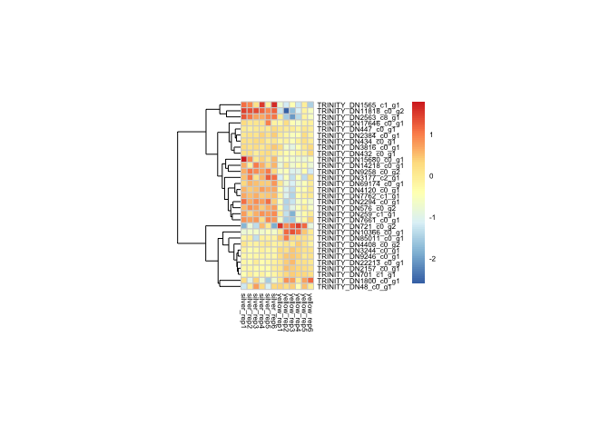

extra\_numbers
================
Ludovic Dutoit
01/09/2021

This little document pick a couple of extra numbers for the ms according
to an email with Lucila (Sep 1)

\#\#Find how many genes are annotated:

``` sh
#denovoassembly_annotation_reportNOMISSING.xls | cut -f 1 | sort | uniq
#denovoassembly_annotation_reportNOMISSING.xls | cut -f 1 > genes_with_some_annotation.txt
```

\#\#\#find out how many of the genes that pass filtering are
annotated

``` r
annotated <- as.character(read.table("genes_with_some_annotation.txt")[,1])
passingfilter<-as.character(read.table("results_files/ALLgenes_results.txt",h=T)[,1])
length(which(passingfilter%in%annotated))
```

    ## [1] 20810

## Part 2: obtain a heatmap of specific 31 genes.

### Heatmaps focus genes

Those are the focus
genes

``` r
gene_names<-c("TRINITY_DN701_c1_g1","TRINITY_DN2157_c0_g1","TRINITY_DN4120_c0_g1","TRINITY_DN3177_c2_g1","TRINITY_DN11818_c0_g2","TRINITY_DN7661_c0_g1","TRINITY_DN1565_c1_g1","TRINITY_DN7762_c1_g1","TRINITY_DN9258_c0_g2","TRINITY_DN447_c0_g1","TRINITY_DN9246_c0_g1","TRINITY_DN69174_c0_g1","TRINITY_DN3816_c0_g1","TRINITY_DN434_c0_g1","TRINITY_DN14218_c0_g1","TRINITY_DN259_c1_g1","TRINITY_DN2294_c0_g1","TRINITY_DN15680_c0_g1","TRINITY_DN2563_c8_g1","TRINITY_DN576_c0_g2","TRINITY_DN432_c0_g1","TRINITY_DN2384_c0_g1","TRINITY_DN22213_c0_g1","TRINITY_DN721_c0_g2","TRINITY_DN1800_c0_g1","TRINITY_DN3244_c0_g1","TRINITY_DN10366_c0_g1","TRINITY_DN4408_c0_g2","TRINITY_DN85011_c0_g1","TRINITY_DN17646_c0_g1","TRINITY_DN48_c0_g1","TRINITY_DN3798_c0_g1")
```

Run the modelling

``` r
library(tidyr)
library(DESeq2)
```

    ## Loading required package: S4Vectors

    ## Warning: package 'S4Vectors' was built under R version 3.6.3

    ## Loading required package: stats4

    ## Loading required package: BiocGenerics

    ## Loading required package: parallel

    ## 
    ## Attaching package: 'BiocGenerics'

    ## The following objects are masked from 'package:parallel':
    ## 
    ##     clusterApply, clusterApplyLB, clusterCall, clusterEvalQ,
    ##     clusterExport, clusterMap, parApply, parCapply, parLapply,
    ##     parLapplyLB, parRapply, parSapply, parSapplyLB

    ## The following objects are masked from 'package:stats':
    ## 
    ##     IQR, mad, sd, var, xtabs

    ## The following objects are masked from 'package:base':
    ## 
    ##     anyDuplicated, append, as.data.frame, basename, cbind, colnames,
    ##     dirname, do.call, duplicated, eval, evalq, Filter, Find, get, grep,
    ##     grepl, intersect, is.unsorted, lapply, Map, mapply, match, mget,
    ##     order, paste, pmax, pmax.int, pmin, pmin.int, Position, rank,
    ##     rbind, Reduce, rownames, sapply, setdiff, sort, table, tapply,
    ##     union, unique, unsplit, which, which.max, which.min

    ## 
    ## Attaching package: 'S4Vectors'

    ## The following object is masked from 'package:tidyr':
    ## 
    ##     expand

    ## The following object is masked from 'package:base':
    ## 
    ##     expand.grid

    ## Loading required package: IRanges

    ## Loading required package: GenomicRanges

    ## Loading required package: GenomeInfoDb

    ## Warning: package 'GenomeInfoDb' was built under R version 3.6.3

    ## Loading required package: SummarizedExperiment

    ## Loading required package: Biobase

    ## Welcome to Bioconductor
    ## 
    ##     Vignettes contain introductory material; view with
    ##     'browseVignettes()'. To cite Bioconductor, see
    ##     'citation("Biobase")', and for packages 'citation("pkgname")'.

    ## Loading required package: DelayedArray

    ## Warning: package 'DelayedArray' was built under R version 3.6.3

    ## Loading required package: matrixStats

    ## 
    ## Attaching package: 'matrixStats'

    ## The following objects are masked from 'package:Biobase':
    ## 
    ##     anyMissing, rowMedians

    ## Loading required package: BiocParallel

    ## 
    ## Attaching package: 'DelayedArray'

    ## The following objects are masked from 'package:matrixStats':
    ## 
    ##     colMaxs, colMins, colRanges, rowMaxs, rowMins, rowRanges

    ## The following objects are masked from 'package:base':
    ## 
    ##     aperm, apply, rowsum

``` r
library(pheatmap)
library(stringr)
library(ggplot2)
library(dplyr)
```

    ## 
    ## Attaching package: 'dplyr'

    ## The following object is masked from 'package:matrixStats':
    ## 
    ##     count

    ## The following object is masked from 'package:Biobase':
    ## 
    ##     combine

    ## The following objects are masked from 'package:GenomicRanges':
    ## 
    ##     intersect, setdiff, union

    ## The following object is masked from 'package:GenomeInfoDb':
    ## 
    ##     intersect

    ## The following objects are masked from 'package:IRanges':
    ## 
    ##     collapse, desc, intersect, setdiff, slice, union

    ## The following objects are masked from 'package:S4Vectors':
    ## 
    ##     first, intersect, rename, setdiff, setequal, union

    ## The following objects are masked from 'package:BiocGenerics':
    ## 
    ##     combine, intersect, setdiff, union

    ## The following objects are masked from 'package:stats':
    ## 
    ##     filter, lag

    ## The following objects are masked from 'package:base':
    ## 
    ##     intersect, setdiff, setequal, union

``` r
library(matrixStats)
library(pheatmap)
library(edgeR)
```

    ## Loading required package: limma

    ## 
    ## Attaching package: 'limma'

    ## The following object is masked from 'package:DESeq2':
    ## 
    ##     plotMA

    ## The following object is masked from 'package:BiocGenerics':
    ## 
    ##     plotMA

``` r
library("RColorBrewer")

counts=read.csv("results_files/RSEM_gene_counts.txt", sep="", head=T)
head(counts)
```

    ##                        silver_rep1 silver_rep2 silver_rep3 silver_rep4
    ## TRINITY_DN0_c0_g1             6861     6563.66     5170.09        6797
    ## TRINITY_DN100000_c0_g1           2        1.00        3.00           0
    ## TRINITY_DN100001_c0_g1           0        0.00        0.00           1
    ## TRINITY_DN100002_c0_g1           2        0.00        0.00           0
    ## TRINITY_DN100003_c0_g1           1        2.00        2.00           0
    ## TRINITY_DN100004_c0_g1           5        2.00        2.00           2
    ##                        silver_rep5 silver_rep6 yellow_rep1 yellow_rep2
    ## TRINITY_DN0_c0_g1          6089.59     6081.01     5431.87        2569
    ## TRINITY_DN100000_c0_g1        1.00        3.00        0.00           0
    ## TRINITY_DN100001_c0_g1        0.00        1.00        0.00           1
    ## TRINITY_DN100002_c0_g1        0.00        0.00        1.00           0
    ## TRINITY_DN100003_c0_g1        0.00        1.00        0.00           1
    ## TRINITY_DN100004_c0_g1        5.00        5.00        2.00           7
    ##                        yellow_rep3 yellow_rep4 yellow_rep5 yellow_rep6
    ## TRINITY_DN0_c0_g1             3088        3603        4274        5017
    ## TRINITY_DN100000_c0_g1           0           5           0           0
    ## TRINITY_DN100001_c0_g1           0           0           0           0
    ## TRINITY_DN100002_c0_g1           0           0           0           0
    ## TRINITY_DN100003_c0_g1           2           0           1           1
    ## TRINITY_DN100004_c0_g1           3           8           6          10

``` r
samples=cbind(colnames(counts),rep(c("silver","yellow"),each=6))
rownames(samples)<-samples[,1]
samples=as.data.frame(samples[,-1])
colnames(samples)<-"treatment"
treatment <- factor(rep(c("silver","yellow"),each=6))
des <- model.matrix(~treatment)
dge <- DGEList(counts=counts) 
keep <- filterByExpr(counts, des) # inside function of limma aware of the design to remove rad counts
dge <- dge[keep,keep.lib.sizes=FALSE]

dge<- calcNormFactors(dge)
print("After filtering, kept a matrix of X genes by Y samples:")
```

    ## [1] "After filtering, kept a matrix of X genes by Y samples:"

``` r
dim(dge) 
```

    ## [1] 32447    12

``` r
logCPM <- cpm(dge, log=TRUE)
```

Isolate those focus
genes:

``` r
dds=DESeqDataSetFromMatrix(countData = round(dge$counts),colData = samples,design = ~ treatment)
```

    ## converting counts to integer mode

``` r
rld <- rlog(dds, blind=F)

genes_ofinterest<-c()
focus<-logCPM[rownames(logCPM)%in%gene_names,]
##Heatmap of significant genes
mat<-assay(rld)[which(rownames(assay(rld))%in%gene_names),]

mat<-focus
mat <- mat - rowMeans(mat) 

colnames(mat)<-colnames(focus)

#and saving
pheatmap(mat,show_rownames = T,cellwidth=5,cellheight=5,border_color="lightgrey",cluster_row=T,cluster_col=F,fontsize=6) 
```

<!-- -->

``` r
pdf("heatmapfocusgenes.pdf")
pheatmap(mat,show_rownames = T,cellwidth=5,cellheight=5,border_color="lightgrey",cluster_row=T,cluster_col=F,fontsize=6) 
dev.off()
```

    ## pdf 
    ##   3

``` r
#easy to visualize rownames
```
